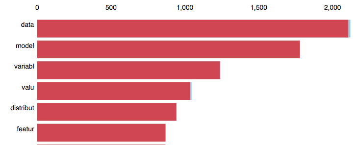

# Discovering-Topics-in-a-Corpus-using-Latent-Dirichlet-Allocation

## View a [Presentation](https://docs.google.com/presentation/d/e/2PACX-1vSRFOh2FsPy1Alaz6S6dtirsbbZMTqTCj0Xi9whhLAR-8SFX6zHxWN1Cgxh5gvhq4Dgqibrcp1uFbIv/pub?start=true&loop=false&delayms=10000) for this repo


--------------------------------------------------------------
--------------------------------------------------------------

_Slide 1_

# Discovering Topics in a Corpus using Latent Dirichlet Allocation


_My name is Tovio Roberts and I'm going to talk a bit about Latent Dirichlet Allocation, but before we get into LDA..._

<hr><hr><br><br><br>_Slide 2_

# About me
- Tovio Roberts
    - Former Arabic major @Wayne State, Detroit
        - lots of language study in a variety of languages
    - Former CompSci mentor with cognitively diverse college students
    - Galvanize DSI 64 alumnus
    - Lead Technical Admissions Officer for the Data Science Immersive at Galvanize
    - Data Specialist at Carbon Collective
    - Former CompSci major @MSU
        - Currently IDP in Machine Learning @MSU, ~Spring 2019?
    - Exploring Masters programs in Computational Linguistics

- github/clownfragment
- dataisartisdata.com
- tovioroberts@gmail.com
- linkedin.com/in/Tovio-Roberts

_A little bit about me..._

_I've studied languages quite a bit, was a former Arabic major._

_I currently work as the lead technical admissions officer for the Data Science Immersive at Galvanize and as the data specialist for a small startup called Carbon Collective._

_I worked for about 5 years as a CompSci mentor with Cognitively Diverse college students._

_Last spring I attended the 3 month Data Science Immersive at Galvanize, which is where I first encountered LDA._

<hr><hr><br><br><br>_Slide 3_

# First, Let's Frame a Use Case


_So let's motivate LDA through a context._

_In a university, there are many departments. Let's say MSU, wants to digitize their study resources across all departments and create a document recommender system. The recommender should suggest materials based on documents similar to what a given student is studying. The administration plans on pooling thousands of digital documents into a single corpus._

_Notice here that the concept of a "subject" is defined by humans. Potentially, the documents could be given tags to facilitate searching. However, we're hoping to automate the process of document suggestion with less human-intervention._


<hr><hr><br><br><br>_Slide 4_

# Subjects vs Topics
- **Subject**: human-projected category, ie., History, Biology, Data Science
- **Topic**: a latent signal discerned within a corpus, often described by a list of words/stems that "should make sense" to a human observer

_I'm going to suggest that we should abandon the human-projected subjects associated with the documents in order to deliver appropriate study materials from many different departments. We might want to do this because we care primarily about the content of the document.  For example, if we're discussing formal languages, we want to make sure that content from the Linguistics department that is similar to content from the Computer Science department, such as those describing the Chomsky hierarchy of formal grammars, be related regardless of the department._

_We want the machine to do the work of discovering the distribution of latent topics in a given document._


<hr><hr><br><br><br>_Slide 5_

# What do We Feed to the Machine?


_What do we feed to the machine?_

<hr><hr><br><br><br>_Slide 6_

# Term Frequency (TF) Matrix

- aka, Bag of Words/Term Frequency
    - order of words in the document is not relevant
    - sparse matrix
- Requires an NLP cleaning pipeline

_Theoretically, Latent Dirichlet Allocation requires a Term Frequency Matrix, though I've used TFIDF matrices with similar results. Keep in mind that the input matrix is rather wide, the length of a row being the length of the vocabulary of the entire corpus. In other words, there's a column for every distinct word found in every document in the input._

<hr><hr><br><br><br>_Slide 7_

# TF Matrix / Bag of Words

| doc index | word0 | word1 | word2 | word3 |... | wordn
|-----------|-------|-------|-------|-------|----|------
|doc0       | 0     | 1     | 0     |  2    |... | 1
|doc1       | 0     | 0     | 1     |  0    |... | 0
|doc2       | 1     | 2     | 0     |  0    |... | 0
|doc3       | 1     | 0     | 0     |  1    |... | 1
|...        | ...   | ...   | ...   | ...   |... | ...
|docn       | 0     | 2     | 0     |  0    |... | 0

_So, every document in our input is represented by a row, and has a frequency value for every word in the vocabulary. Realistically , a given document will not contain most of the words in the vocabulary, thus this is a sparse matrix._

_We arrive at a usable TF Matrix through constructing a Cleaning Pipeline. To give a sense of what this pipeline is doing, let's look at some real documents._

<hr><hr><br><br><br>_Slide 8_

# Let's Build a Corpus
- Sample of 36000 documents ([Anki](https://apps.ankiweb.net/) flash cards) from 3 Human-Defined Subjects
    - 12000 from History
    - 12000 from Data Science/Statistics
    - 12000 from Biology
- Using 1-grams, for sake of dimensionality, though n-grams are possible
- Remove words most/least common across documents

_As a proof of concept, let's build a corpus where the documents come from 3 distinct, human-defined subjects, History, Data Science, and Biology. I used flash card decks contributed to ankiweb to construct the corpus._

_We can imagine that a topic-modeling algorithm searching for 3 topics will likely distinguish three topics represented by words that seem to satisfy the three subjects._

_I'm using 1-grams here for "words," but there's no reason that you couldn't use any n-gram representation, it just massively increases the dimensions of the sparse matrix and wasn't at all necessary given the subject delineation of this corpus._

_One last adjustment that I commit is to remove the words that appear in more than a certain percentage of documents, as well as words that only appear in less than a certain number of documents. This has an effect similar to the penalization you see in Term Frequency, Inverse Document Frequency, TFIDF._

<hr><hr><br><br><br>_Slide 9_

# Input Must be Cleaned


_This is a wordcloud from just the Data Science cards. We can see a number of artifacts from html, javascript and LaTEX. My pipeline includes functions to strip code, numeric characters and LaTEX. I will likely rewrite my cleaning functions to keep the LaTEX in a translated form, as some cards are only LaTEX. For example, we can imagine that the word 'derivative' would likely contribute to a document's topic distribution, so removing the occurrence of "derivative" for a given document is probably not good._


<hr><hr><br><br><br>_Slide 10_

# Features (words) should be Canonical
- Stemming: reduce to a "root" form
    - Eliminates tense
- Could instead lemmatize for potentially more readable root word


_In general when we use a TF or TFIDF matrix, we want to stem or lemmatize the words. Stemming strips different endings on a given word, such as the words "complex" and "complexity", to a single form. Lemmatizing puts words into a canonical form, for example, changing occurrences of "am" or "is" into "be". I used stemming in what I'm going to show, though I generally prefer to lemmatize._

<hr><hr><br><br><br>_Slide 11_

# Cleaned/Stemmed Document


_This is a single document, before and after cleaning. The underlined words illustrate stemming, html has been removed, and everything is lowercased._

<hr><hr><br><br><br>_Slide 12_

# Data Science Cards, Cleaned and Stemmed


_Here we see a wordcloud of the cleaned and stemmed vocabulary from the DataScience flashcard deck. The larger the word, the more frequently it occurs in the corpus._

<hr><hr><br><br><br>_Slide 13_

# Biology Cards, Cleaned and Stemmed


_And the same for Biology_

<hr><hr><br><br><br>_Slide 14_

# History Cards, Cleaned and Stemmed


_And History_

<hr><hr><br><br><br>_Slide 15_

# Cleaned Corpora Combined


_And here we see a wordcloud for the entire corpus. There are some remnants of markup and code, but I think we're doing ok, and those remnants will be informative later on._

_I just want to take a moment and say that Data Cleaning takes a long time. In natural language processing, especially when using a bag of words or TFIDF representation of documents, cleaning is key as it provides better consistency and reduces dimensionality of your input._

<hr><hr><br><br><br>_Slide 16_

# Some Selected Word Counts


_If we look at some counts of words from the different decks, we can get an idea of word relevance or salience to a given subject. It's very telling that the word "distribution" occurs 800 times in the Data Science deck, and less than 40 times in each of the other two decks. The word "cell" does not occur in History, and "war" only occurs in "History"._

_Intuitively, we can start thinking of modeling topics as a process involving observation of word occurrences in documents in relation to word occurences within the corpus._

<hr><hr><br><br><br>_Slide 17_

# What is Topic Modeling?
- Unsupervised Learning method for finding latent semantic structures in a text or corpus
- Common to assume that a given document is primarily "about" a given topic
- Common to assume that a document clustered into a given topic will have a high occurrence of topic-salient words

_That intuition is justified. Topic Modeling is the field within unsupervised learning dedicated to finding latent semantic structures within text and within corpora._

_For our purposes, let's assume that a given document is primarily about a given topic and that that document will contain a high frequency of words representative of that topic._

_Now that we have a prepared corpus and an understanding that our goal is to discern latent semantic structures in the corpus, we can more easily describe LDA._

<hr><hr><br><br><br>_Slide 18_

# Latent Dirichlet Allocation
- [2003: David Blei, Andrew Ng, and Michael I. Jordan](http://www.cs.columbia.edu/~blei/papers/BleiNgJordan2003.pdf)
- "LDA yields list of salient groups of related words over a collection, with documents represented as a mixture of these groups."
    - A document is a probability distribution over topics
    - A topic is a probability distribution over words
- More Intuitive Interpretation than [SVD](https://en.wikipedia.org/wiki/Singular_value_decomposition) or NMF
    - ie., doc0 = {topic1: 50%, topic2: 25%,  topic3 : 25%}

_Latent Dirichlet Allocation is one of the most common topic modeling algorithms, alongside more matrix-based techniques such as Singular Value Decomposition and Non-Negative Matrix Factorization._

_"LDA is capable of yielding a list of salient groups of related words, aka 'topics', over a collection, with documents represented as a mixture of these groups or topics."_

_In LDA, we can think of a document as a probability distribution over topics, and a topic as a probability distribution over words. Notice here, again, that we will assume that documents with similar topics will use similar groups of words. **Latent topics are discovered by discovering groups of words in the corpus that frequently occur together within documents**_

_What really discerns LDA from other bag of words models, like NMF or SVD, is that we're not really focused on the term frequencies, we are concerned with the distribution of words across topics._


<hr><hr><br><br><br>_Slide 19_

# LDA, a Simple Metaphor, New to Town...
- you want to figure out peoples' (words') interests (topics) in a city based on where they hang out
- assume that people go to specific places based on interests they share with other people who go to those places
- assume we can associate people with interests and places with interests


_Let's say you move to a new city and you want to figure out people's interests based on where they hang out. If you assume people go to specific places based on interests they share with other people, then we can assume that interests are represented by a cross section of people. We can also assume that places draw certain people because places exist, in some sense, as mixtures of interests. For example, multiple interests may draw people to a park or coffee shop, but multiple people might be drawn to the park for the same interest._

<hr><hr><br><br><br>_Slide 20_

# ... Walking around town

1. Choose a number of interests/topics, k=3
2. Guess as to what people are indicative of the given interests
3. Guess the interests that draw a specific person to a specific place
4. Over and over again
    - For each place and person
        - update likelihood of the guesses based on other people in that space

- The guesses will get better


_You decide that there are 3 interests people may have that would lead them to a certain place._

_You take a first walk around town and record guesses as to which people represent certain interests, and you guess percentages of the 3 interests that might draw people to a given place._

_Since you're new in town, you're very likely to make a lot of bad guesses. However, you're planning on repeating your walk every day for a few years, updating the guesses in your notebook on every walk._

_You'll start recognizing that certain people appear in certain places, in the company of other people with similar interests. Eventually, you find that you can describe interests in terms of the people who are into those interests._

<hr><hr><br><br><br>_Slide 21_

# LDA, Restated
[2012 LDA Article by Colorado Reed](http://obphio.us/pdfs/lda_tutorial.pdf)
- Given a Corpus of documents, LDA learns the topic representation in each document and the word distribution of each topic
- LDA identifies the topics that are likely to have generated the corpus
- Uses a sparse Dirichlet prior:
    - Samples from a simplex, the k topic probabilities add to 1

_So let's restate LDA really quick then describe a less metaphorical view of the LDA procedure._

_Given a corpus of documents, LDA learns the topic representation in each document and the word distribution of each topic. The assumption is that a distribution of topics is used to generate each document within the corpus._

_We use a sparse Dirichlet prior to seed the topic probabilities in the documents, since it provides a mixture of probabilities that sum to one._

<hr><hr><br><br><br>_Slide 22_

# LDA, High-Level View
[For more in-depth view of LDA, see the accompanying notebook](https://github.com/clownfragment/Discovering-Topics-in-a-Corpus-using-Latent-Dirichlet-Allocation/blob/master/lda_notes.ipynb)
1. Randomly assign each word in each document to one of the _k_ topics
2. For each document $d$:
    - Assume all topic assignments except for current one to be correct
    - Calculate 2 proportions
        1. Proportion of words in document $d$ that are currently assigned to topic $t = p(\text{topic } t \mid \text{document }d)$
        2. Proportion of assignments to topic $t$ over all documents that came from this word $w = p(\text{word }w \mid \text{topic }t)$
    - multiply the proportions and assign $w$ a new topic based on that probability.
        - $p(\text{topic } t \mid \text{document }d) \times p(\text{word } w \mid \text{topic }t)$
            - probability that topic $t$ generated word $w$ in a given document
3. Reach steady state and return parameters

_So here is a slightly deeper way to understand what LDA is doing. If you look at the github repo for this presentation, there's more in-depth material there, along with links to further explanations._

_Let's walk through this really quick before taking a look at some results._

_Initially, we randomly assign each word in each document to a topic. We then look at each document in turn and calculate the proportion of words in that document that are currently assigned to a given topic. We also calculate the proportion of assignments of that topic over all documents that have that word. We multiply those proportions and assign a new topic to the document based on that product._

_We do this over and over again for every document, either for a maximum number of epochs or until we don't see a significant update in the probability distributions._

_This is effectively the Expectation Maximization algorithm, but using the Dirichlet distribution instead of a Gaussian. I have some pseudocode for the EM for LDA in the repo for these notes._

<hr><hr><br><br><br>_Slide 23_

# Results on the Flashcard Corpus
[Repo for LDA on flashcard corpus](https://github.com/clownfragment/a-smarter-flashcard)

* [Interactive LDA on Term Freq Matrix of Full Corpus](https://rawgit.com/clownfragment/a-smarter-flashcard/master/images/all_count_vect_topics.html)
* [Interactive LDA on TF-IDF Matrix of Full Corpus](https://rawgit.com/clownfragment/a-smarter-flashcard/master/images/all_tfidf_vect_topics.html)
* [Interactive LDA on Term Freq Matrix of Biology Subcorpus](https://rawgit.com/clownfragment/a-smarter-flashcard/master/images/bio_count_vect_topics.html)
* [Interactive LDA on TF-IDF Matrix of Biology Subcorpus](https://rawgit.com/clownfragment/a-smarter-flashcard/master/images/bio_tfidf_vect_topics.html)
* [Interactive LDA on Term Freq Matrix of Data Science Subcorpus](https://rawgit.com/clownfragment/a-smarter-flashcard/master/images/datascience_count_vect_topics.html)
* [Interactive LDA on TF-IDF Matrix of Data Science Subcorpus](https://rawgit.com/clownfragment/a-smarter-flashcard/master/images/datascience_tfidf_vect_topics.html)
* [Interactive LDA on Term Freq Matrix of History Subcorpus](https://rawgit.com/clownfragment/a-smarter-flashcard/master/images/his_count_vect_topics.html)
* [Interactive LDA on TF-IDF Matrix of History Subcorpus](https://rawgit.com/clownfragment/a-smarter-flashcard/master/images/his_tfidf_vect_topics.html)

_So let's look at some results of the LDA model. I used the Gensim version instead of the sklearn version of LDA. To visualize the topic distributions, I'm using a pretty amazing tool called PyLDAvis._
**If you check out LDA Term Freq of Full Corpus**

_The Left side of the Plot is constructed using MDS (MultiDimensional Scaling) where PCA is projecting to a 2-dimensional space.  Jensen-Shannon divergence gives a relative distance between topic distributions of words. The x and y axes don't mean much here aside from framing those relative distances._

_The sizes of the topic bubbles indicate the prevalence of a given topic, which is not the number of documents in a given topic cluster, but the occurrence of a given topic across the entire corpus._
**Click on Topics 1, 2 and 3**

_Let's look at each topic in turn and look at words in each topic ranked by their topic-specific probability, or $\lambda$ set to 1. Here, $\lambda$, controls a log likelihood weighting between term probabilities within the topic and the discernment power of terms within the topic, also known as the lift. By setting $\lambda$ to one, we are seeing words that have high frequency within that topic. What we're not seeing is the uniquely definitive words for that topic, which we can tune in by lowering the value of lambda._


<hr><hr><br><br><br>_Slide 24_

# What does Topic 1 Reflect?


_So we can make a guess as to what subject topic 1 seems to be reflecting. Remember, we pooled three subjects, Data Science, Biology and History. The high occurrence words for topic 1 are data, model, variable, value, distribution, feature... what does that sound like?  Data Science_

<hr><hr><br><br><br>_Slide 25_

# What does Topic 2 Reflect?


_Topic 2 has a high occurrence of words like state, war, empire, people, and power.  What does that sound like?  History.  Notice here that the word "amask" is high-occurring as well. That is a formatting remnant that was not removed during cleaning, as is the word "style" which occurs a little further down._

<hr><hr><br><br><br>_Slide 26_

# What does Topic 3 Reflect?


_Topic 3 is pretty clearly representative of cards from Biology._

<hr><hr><br><br><br>_Slide 27_

# What if our Corpus is Not So Delineated?
* [Interactive LDA on Term Freq Matrix of Biology Subcorpus](https://rawgit.com/clownfragment/a-smarter-flashcard/master/images/bio_count_vect_topics.html)
    - What is happening with Topic 5?
    - Notice the crossover between Topic 1 and Topic 3
* Interpreting these Topics:
    - Topic 5: code remnants
    - Topics 1 & 3: cellular biology?
    - Topic 2: pathology on the cellular level?
    - Topic 4: disease and diagnosis?

_So it's not a big surprise that a corpus of such distinct subjects as Biology, History and Data Science would so clearly segment into three topics. That's a bit of a tautology. I did that to provide some confidence that LDA is working_
**click on link to Bio deck**

_To get a more realistic sense of LDA, let's look at just one of the flashcard sets, the Biology deck. In this case, I set the number of topics to 5, so k=5. There were 12000 documents as input._

_Remember when I mentioned that there were some markdown and code tags that I didn't effectively remove? Topic 5 is clearly represented by words from javascript and document formatting. I left this in because I wanted to point out that another use case for LDA is as an informant for data cleaning and other non-semantic NLP applications._

_Topics 1 and 3 have a lot of overlap. It's possible to imagine that the Jensen-Shannon distance between their word distributions is low and that if we only built the model with 4 topics, It seems likely that Topics 1 and 3 would fuse together. However, LDA does not explicitly capture correlations between topics, and here we're only looking at an intertopic distance based on the similarity between 1 and 3's distributions of words._

_If we look at Topic 2, the most probable words are infect, organ, virus, bacteria, species. I would guess that Topic 2 generally concerns pathology on a cellular level_

_Topic 4 has top words like cause, association, common, use, treatment, and further down, words like patient, rash, pneumonia. I think this topic relates to disease and diagnosis._

<hr><hr><br><br><br>_Slide 28_

# LDA Advantages
- Effective depending on the size of the corpus
- Interpretable output and topic representation
- Great visualization tools ([pyLDAvis](https://github.com/bmabey/pyLDAvis), [YellowBrick](http://www.scikit-yb.org/en/latest/), etc)
- Can be applied to many types of problems, not just NLP
- Can be used as engine in recommender systems

_So let's consider some of the advantages of the LDA model. It's effective at providing interpretable topics. It has some pretty amazing visualization tools. It can be applied in a variety of places, aside from natural language processing, such as genomic studies and image segmentation. One of the primary places it is seen is within recommender systems, which gets us back to the initial framing. It's possible to imagine that the digitized materials across a number of university departments could be appropriately recommended to students through offering documents that have topic distribution similarity_

<hr><hr><br><br><br>_Slide 29_

# LDA Disadvantages
- Cannot Explicitly Capture Correlations between Topics
- No preservation of word order in the documents unless we use n-grams and massively increase dimensionality
- Number of topics?
    - Growing Corpus Problem
- Human validation is often necessary

_So what are some of the drawbacks of LDA? We can't explicitly capture correlations between topics, as we saw in those two close topics in the Biology visualization. Additionally, we don't preserve the syntax in the documents. If we use n-grams to capture phrases, the TF Matrix increases quite a lot and model rebuilds take much longer._

_Another problem concerns how to decide the number of topics k. This decision can be made using prior knowledge of the documents that make up the corpus, but what if the corpus is changing and growing? How do we decide when to rebuild the LDA model in order to accommodate emergent topics over time? The classic approach is to..._

<hr><hr><br><br><br>_Slide 30_

# Put Eyes on It...

[Matti Lyra - Evaluating Topic Models, Berlin 2017](https://www.youtube.com/watch?v=UkmIljRIG_M)

_Put eyes on it. Since the idea of a topic is that it's a latent semantic signal within the corpus, the sensibility of a topic is something that seems to require non-machine observation over different values of k_

_There's an excellent lecture on this problem, with Matti Lyra, the link is in this slide. Essentially, the metrics available for topic modeling are often pretty unhelpful, or worse, misleading. However, constantly requiring human validation of topics is time consuming, costly and ongoing when you have a growing corpus._

_I'm not going to get into the current metrics applied to topic modeling and LDA, I'll just recommend the Matti Lyra lecture for that._

<hr><hr><br><br><br>_Slide 31_

# Naive K Topic Selection
[See this repo for output from evaluation plots](https://github.com/clownfragment/a-smarter-flashcard)

**TFIDF Matrix**<br>

$
\Downarrow
$<br>

**Dimensional Reduction using Singular Value Decomposition (SVD)**<br>
&nbsp;Normalize output

$
\Downarrow
$<br>

**KMeans with clusters** $\mathbf k = [2, 3, ..., K]$<br>
&nbsp;Can plot the gap statistic at every value of $k$<br>
&nbsp;Can create elbow plots of the distortion at every value of $k$<br>
&nbsp;Can measure intracluster distance<br>

$
\Downarrow
$<br>

**Apply KMeans labels to rows in SVD-reduced matrix**<br>

$
\Downarrow
$<br>

**Project to 2D using tSNE**<br>
&nbsp;Can measure entropy in the resulting matrix<br>
&nbsp;Can quickly look at resulting similarity projection

_Instead, I'm going to show a naive procedure for validating topics that I came across in the Yellowbrick documentation. It uses dimensional reduction and kmeans, and a projection to 2 dimensions using tSNE._

_This is a sort of meta-evaluation since it doesn't use LDA directly. If you're not familiar with KMeans, just think of it as a way to group similar rows of data into clusters. Since Kmeans breaks down at high dimensions, due to the curse of dimensionality, I use SVD to reduce the dimensions to 50 singular value components that represent the variance present in a sparse TFIDF matrix of the input._

_I build KMeans over and over using a range of k clusters, each time assigning the clustering results as labels on the documents. Keep in mind that, unlike LDA, KMeans does not assign a topic distribution to the documents, it only assigns a single cluster value, which is appended to each row so that we can see some color in the tSNE plots. The assumption being made here is that document similarity will be enough to discern an appropriate number of topics by way of choosing an optimal number of clusters. To decide on an appropriate number of clusters, we can use Elbow plots for the gap statistic or for the distortion. I've linked to resources for those from this slide, and with these metrics or by minimizing intracluster distances in KMeans, it's possible to automatically trigger a rebuild of the LDA model with a different number of topics._

_I'm not going to show that here, though I think it does make for a good solution to the growing corpus problem. If you look at the repo linked from this slide, there are elbow and silhouette plots for various sample sizes of the corpus and for various values of K clusters. In fact, if you generate a corpus and want to run an LDA diagnostic on it, the scripts in the source repo should get you started. There's also a Flask-based recommender that you can plug in LDA, NMF or any other other model commonly used for recommenders. You'll have to modify it a bit for your use case. Eventually, I'm going to create an LDA auto-rebuild feature in that recommender as a proof of concept of taking human eyes off of the topic validation._

_I'm only going to show the tSNE plots, and if you want to see more than that, dig into the repo. I think this tSNE approach is pretty neat, visually understandable and can be used in other situations where you want visual confirmation of underlying signal in high dimensional data._

<hr><hr><br><br><br>_Slide 32_

# About [SVD](https://en.wikipedia.org/wiki/Singular_value_decomposition)

- Common dimensionaly reduction technique
- Reduce sparse TF matrix to 50 singular values
    - Singular value matrix where singular values
    are uncorrelated and collectively account for
    xx% of the variance in the data
- SKlearn's [PCA](http://scikit-learn.org/stable/modules/generated/sklearn.decomposition.PCA.html) uses full SVD under the hood
- Using [truncatedSVD](http://scikit-learn.org/stable/modules/generated/sklearn.decomposition.TruncatedSVD.html) here to return a reduced, dense matrix


_So let's briefly talk about SVD, KMeans and tSNE so that the tSNE plots make sense. I'm not going into what's under the hood with these, I'm just going to discuss their use in generating the plots. I also want to say that this procedure may have glaring flaws that I have yet to understand, especially regarding the assumption that meaningful distances will be maintained in the dimensionally reduced input to KMeans. I think it is maintained, but I'm still reading on this. Anyway,_

_Singular Value Decomposition is used here to reduce the dimensionality of the sparse matrix, since KMeans doesn't do well with high dimensions. The resulting matrix is composed of uncorrelated singular values, very much like principal components in PCA, that account for a high percentage of the variance in the original data. We're not particularly concerned with that percentage. We're getting the top 50 uncorrelated singular values and rebuilding a dense matrix as input to KMeans_

<hr><hr><br><br><br>_Slide 33_

# About [KMeans](https://en.wikipedia.org/wiki/K-means_clustering)
![By Chire [GFDL (http://www.gnu.org/copyleft/fdl.html) or CC BY-SA 4.0  (https://creativecommons.org/licenses/by-sa/4.0)], from Wikimedia Commons](https://upload.wikimedia.org/wikipedia/commons/e/ea/K-means_convergence.gif)
- partition $n$ observations into $k$ clusters
    - Assign each observation to nearest centroid (closest mean)
    - Calculate new centroids
    - Convergence
- Here, we're using sklearn's [KMeans](http://scikit-learn.org/stable/modules/generated/sklearn.cluster.KMeans.html) to generate cluster labels to be applied to the reduced document matrix so that we can add label colors to tSNE


_So now that dimensions are reduced, the dense matrix is passed into KMeans. Our main use for KMeans here is to generate cluster labels for the documents, which are then applied to the reduced document matrix._

_In this 2d graphic, we're seeing a linear boundary, but remember we're dealing with a 50 dimensional space, so boundaries will be created from multiple hyperplanes, essentially creating convex hulls around the clusters._

<hr><hr><br><br><br>_Slide 34_

# About [tSNE](http://jmlr.org/papers/volume9/vandermaaten08a/vandermaaten08a.pdf)


- t-Distributed Stochastic Neighbor Embedding: [interactive visualization](https://distill.pub/2016/misread-tsne/)
- Effective way to visualize structure in high-dimensional data at 2D or 3D
    - Better at separation than most other [Manifold Learning methods](http://scikit-learn.org/stable/modules/manifold.html)
- Through pairwise comparison
    - Similar observations pull together
    - Dissimilar observations push apart
- Tunable by `Perplexity`: guess about the number of close neighbors
    - Using default values from Yellowbrick [TSNEVisualizer](http://www.scikit-yb.org/en/latest/api/text/tsne.html) for text
- **X and Y are not meaningful here, nor is the intracluster distance!**

_The way I like to think of tSNE is if you throw a bunch of paintballs up in the air and freeze time, then move similar paintballs close to each other, and move dissimilar paintballs further from each other, then unfreeze time and let them all drop down onto a piece of paper on the ground, you'll get a 2dimensional representation of similarity._

_It's important to realize that the axes are meaningless here and distance is meaningful only in the sense that similar items will bunch together. This aspect of tSNE bothers a lot of people, but we're only using it to get a sense as to whether there is underlying structure in the high dimensional data._

_I'm using a tool from Yellowbrick to accomplish the tSNE visualizations, but you could build the plots with matplotlib and sklearn almost as easily if you want to tune the perplexity, which is a metric concerning how many neighbors are expected. Yellowbrick's version of tSNE is pretuned for text and gives a nice plot._

<hr><hr><br><br><br>_Slide 35_

# KMeans/tSNE Visualization on Growing Corpus...


_So let's take a look at tSNE projections and accompanying LDA topic word distributions. I set a random seed here to mimic the idea of adding more documents to an existing corpus, in other words, the 300 documents used at the beginning of the analysis will also be present in the analysis of 600 documents._

_We can see that with 300 documents with 3 topics, the topics aren't particularly clear. They don't seem to meaningfully delineate in the tSNE plot, nor do they make much sense in the LDA top words output._

_But, when we look at 600 documents with 3 topics, the tSNE plot looks like it's gaining some order. Also, I think we start seeing a bit of meaning in the topics. I think it's still a little weak, but it might be enough for a recommender._

<hr><hr><br><br><br>_Slide 36_

# ...KMeans/tSNE Visualization on Growing Corpus...


_Once we're looking at 3000 or more documents, 3 topics delineates pretty nicely into the three subjects we're expecting. The tSNE plots also have some clear groupings._

<hr><hr><br><br><br>_Slide 37_

# ...KMeans/tSNE Visualization on Growing Corpus...


_And here is 12000 documents, which does not seem different from what we were seeing at 3 and 6000 documents. But I think there's a good chance that we're missing an opportunity here to find more topics. If we're building a recommender that is drawing from a great variety of sources, say wikipedia, we might want to use as many as a few hundred topics so that the similarity between two document probability vectors will be most meaningful._

<hr><hr><br><br><br>_Slide 38_

# ...KMeans/tSNE Visualization on Growing Corpus


_So here we're looking at projections of 6000 and 12000 documents, with 5 topics instead of 3. I'm not convinced that 5 topics is doing better than 3 here, but I do think it's worth noting that the groupings on 12000 documents in the tSNE plot on the right are pretty distinct._

_If I look at the top LDA words, I'm not convinced that there's something particularly distinct between Topics 4 and 5, both have to do with History. I think in this case it would make sense to look at a longer list of high probability words. But looking at Topic 1 is pretty interesting. I suspect that Topic 1 concerns machine learning while Topic 2 may be a bit more on the stats side of things._

<hr><hr><br><br><br>_Slide 39_

# Conclusion
- Tovio's Github: https://github.com/clownfragment/
    - Notes: https://github.com/clownfragment/Discovering-Topics-in-a-Corpus-using-Latent-Dirichlet-Allocation
    - Code : https://github.com/clownfragment/a-smarter-flashcard
- Yields interpretable topics
- Great tools
- Meta-analysis techniques for selection of k topics
- Persistent paradigm of putting human eyes on the results

_If you want to dig into this more, please see the github repo. It contains a number of classes for analysis, you can pretty much just plug in a corpus and set it to run and get a lot of plots and other output. There's a recommender built in flask that I hope is pretty easy to customize, I tried to comment things for others to learn, but I'm sure I missed a lot._

_I personally like LDA quite a bit, mostly because the results are very interpretable. You can say to someone that a given document is 20% sports and 30% romance and 50% technology and that can make sense. There are a ton of great tools for LDA, which are linked from these slides._

_The main drawback I see concerns automatic selection of the number of topics, especially if you have a fast growing corpus, such as twitter, reddit, a large online news outlet, places where there is likely to be an emergent topic. I think the naive solution is to use some meta process like minimizing intracluster distance in KMeans or minimizing matrix reconstruction error. Otherwise, or if the corpus is relatively static, the LDA results will be validated by human eyes._

<hr><hr><br><br><br>Slide 40

# Additional Resources:
- [Source Repo for LDA Flashcard Analysis](https://github.com/clownfragment/a-smarter-flashcard/)
- [Further LDA Notes that Accompany this Notebook](https://github.com/clownfragment/Discovering-Topics-in-a-Corpus-using-Latent-Dirichlet-Allocation/blob/master/lda_notes.ipynb)
- Latent Dirichlet Allocation: Towards a Deeper Understanding, Colorado Reed
    - http://obphio.us/pdfs/lda_tutorial.pdf
- LDAvis: A method for Visualizing and interpreting topics
    - https://nlp.stanford.edu/events/illvi2014/papers/sievert-illvi2014.pdf
- _Matti Lyra - Evaluating Topic Models_, Youtube, PyData, 2017 https://www.youtube.com/watch?v=UkmIljRIG_M

- _Estimating the numbers of clusters in a data set via the gap statistic._ Tibshirani, R., Walther, G., and Hastie, T. (2001).  J. R. Statist. Soc. B, 63(2): 411-423. http://www.stanford.edu/~hastie/Papers/gap.pdf


```python

```
